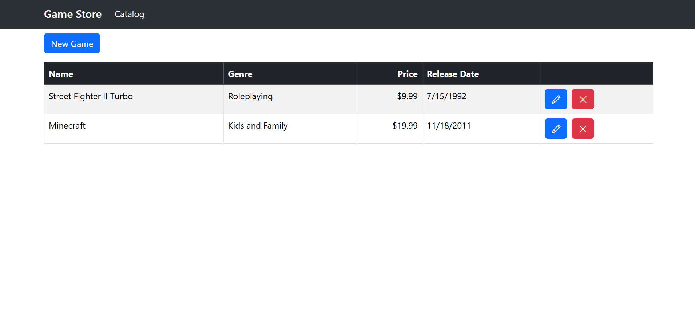
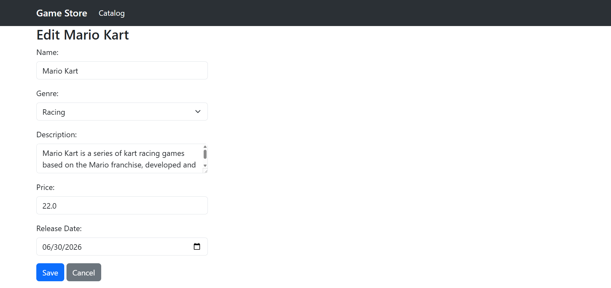

# Video-Game-Store-Pro-Frontend (.NET 8)

Building a ASP.NET Core (.NET 8) web application frontend for a video game store in VS code.

The backend of this project can be found [here](https://github.com/ting11222001/Video-Game-Store-Pro-NET-8-Backend).

## Table of Contents

- [Demo](#demo)
- [Getting Started](#getting-started)
- [Key Concepts](#key-concepts)

## Demo

### Get All Games
Retrieves the full list of games from the store.

### Update Game
Updates the details of an existing game.

### Delete Game
Removes a game from the store.

## Getting Started

See the Backend repo's README [here](https://github.com/ting11222001/Video-Game-Store-Pro-NET-8-Backend).

## Key Concepts

- The frontend is built with Blazor (Razor components)
